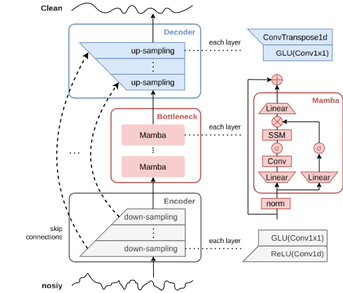
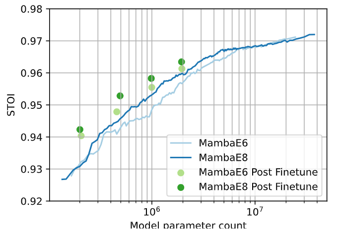

# CleanUMamba: A Compact Mamba Network for Speech Denoising using Channel Pruning

[](https://arxiv.org/abs/2410.11062) 
[](LICENSE) 


This repository contains the official PyTorch implementation and pre-trained models for the paper **"CleanUMamba: A Compact Mamba Network for Speech Denoising using Channel Pruning"**, presented at the 2025 International Symposium on Circuits and Systems (ISCAS).


**Paper Abstract:**
> This paper presents CleanUMamba, a time-domain neural network architecture designed for real-time causal audio denoising directly applied to raw waveforms. CleanUMamba leverages a U-Net encoder-decoder structure, incorporating the Mamba state-space model in the bottleneck layer. By replacing conventional self-attention and LSTM mechanisms with Mamba, our architecture offers superior denoising performance while maintaining a constant memory footprint, enabling streaming operation. To enhance efficiency, we applied structured channel pruning, achieving an 8X reduction in model size without compromising audio quality. Our model demonstrates strong results in the Interspeech 2020 Deep Noise Suppression challenge. Specifically, CleanUMamba achieves a PESQ score of 2.42 and STOI of 95.1% with only 442K parameters and 468M MACs, matching or outperforming larger models in real-time performance.

This codebase is built upon the [CleanUNet repository](https://github.com/NVIDIA/CleanUNet) and was developed as part of a master thesis project from 2023 till 2024.

## Architecture

CleanUMamba utilizes a U-Net like encoder-decoder architecture operating on raw waveforms. The bottleneck replaces conventional layers with Mamba blocks for efficient sequence modeling. 




## Results

### Multi-Head Attention (MHA), LSTM, Mamba, and Mamba S4 Comparison

Comparison of models with same size unit and training conditions on the DNS no-reverb test set.

| Model | Params  | PESQ (WB) | PESQ (NB) | STOI (%) |
|-------|------|----------|----------|-------|
| Mamba | 442K  | **2.42** | **2.95** | **95.1** |
| Mamba S4 | 451K | 2.36 | 2.90 | 94.9 |
| MHA | 443K  | 2.37 | 2.92 | 94.9 |
| LSTM | 443K  | 2.32 | 2.88 | 94.7 | 

Full training runs at [Mamba vs MHA vs LSTM vs MambaS4 For Audio Denoising](https://wandb.ai/sjoerdgroot/Slim-Speech-Enhancement/reports/Mamba-vs-MHA-vs-LSTM-vs-MambaS4-For-Audio-Denoising--Vmlldzo4Mzg4NjM3).


### Pruning experiments

Select pruning runs at [CleanUMamba pruning](https://wandb.ai/sjoerdgroot/Slim-Speech-Enhancement-Pruning/reports/CleanUMamba-pruning--VmlldzoxMjk3MTM4NA).




### Full size model and finetuned pruned models

<table>
  <thead>
    <tr>
      <th>Model</th>
      <th>Params</th>
      <th>Look ahead</th>
      <th>PESQ (WB)</th>
      <th>PESQ (NB)</th>
      <th>STOI (%)</th>
    </tr>
  </thead>
  <tbody>
    <tr>
      <td>CleanUMamba E8 full</td>
      <td>41.37M</td>
      <td>48ms</td>
      <td>3.067</td>
      <td>3.507</td>
      <td>97.4</td>
    </tr>
    <tr>
      <td>CleanUMamba E8 high</td>
      <td>41.37M</td>
      <td>48ms</td>
      <td>3.017</td>
      <td>3.471</td>
      <td>97.2</td>
    </tr>
    <tr>
      <td rowspan="7">Pruned CleanUMamba E8</td>
      <td>14.90M</td>
      <td rowspan="7">48ms</td>
      <td>2.910</td>
      <td>3.397</td>
      <td>97.0</td>
    </tr>
    <tr>
      <td>6.00M</td>
      <td>2.888</td>
      <td>3.359</td>
      <td>96.9</td>
    </tr>
    <tr>
      <td>3.22M</td>
      <td>2.746</td>
      <td>3.253</td>
      <td>96.4</td>
    </tr>
    <tr>
      <td>1.94M</td>
      <td>2.707</td>
      <td>3.222</td>
      <td>96.3</td>
    </tr>
    <tr>
      <td>0.99M</td>
      <td>2.558</td>
      <td>3.102</td>
      <td>95.8</td>
    </tr>
    <tr>
      <td>492K</td>
      <td>2.426</td>
      <td>2.980</td>
      <td>95.3</td>
    </tr>
    <tr>
      <td>201K</td>
      <td>2.189</td>
      <td>2.745</td>
      <td>94.2</td>
    </tr>
    <tr>
      <td>CleanUMamba E6 high</td>
      <td>27.21M</td>
      <td>12ms</td>
      <td>2.935</td>
      <td>3.400</td>
      <td>97.1</td>
    </tr>
    <tr>
      <td rowspan="6">Pruned CleanUMamba E6</td>
      <td>13.50M</td>
      <td rowspan="6">12ms</td>
      <td>2.855</td>
      <td>3.346</td>
      <td>96.9</td>
    </tr>
    <tr>
      <td>7.31M</td>
      <td>2.799</td>
      <td>3.291</td>
      <td>96.8</td>
    </tr>
    <tr>
      <td>1.95M</td>
      <td>2.602</td>
      <td>3.128</td>
      <td>96.1</td>
    </tr>
    <tr>
      <td>1.00M</td>
      <td>2.431</td>
      <td>2.967</td>
      <td>95.5</td>
    </tr>
    <tr>
      <td>457K</td>
      <td>2.237</td>
      <td>2.796</td>
      <td>94.8</td>
    </tr>
    <tr>
      <td>207K</td>
      <td>2.096</td>
      <td>2.660</td>
      <td>94.0</td>
    </tr>
  </tbody>
</table>

Full runs available at [CleanUMamba training](https://wandb.ai/sjoerdgroot/Slim-Speech-Enhancement/reports/CleanUMamba-training--VmlldzoxMjYxNjQ1OA).

## File Structure

```
.
├── configs # Model, training, pruning, and finetuning configurations
│   ├── config.json # General config (paths, batch size, etc.)
│   └── exp
│       ├── models      # Model architecture JSON configs (e.g., CleanUMamba E6/E8)
│       ├── pruning     # Pruning schedule JSON configs
│       └── finetune    # Finetuning schedule JSON configs
├── checkpoints # Pre-trained model checkpoints
│   ├── models      # Checkpoints for fully trained models (before pruning)
│   ├── pruned      # Checkpoints for pruned and finetuned models
│   └── experiments # Checkpoints for smaller scale experiments with different bottleneck layers
├── src # Source code
│   ├── network     # PyTorch network (CleanUMamba)
│   ├── pruning     # Pruning logic (pruning framework, importance calculation)
│   ├── training    # Training, pruning, and finetuning scripts
│   ├── util        # Utilities (datasets, losses, evaluation metrics)
│   └── examples    # Example scripts (checkpoint loading, denoising audio, streaming)
├── LICENSE # Project License
└── README.md # This file
```

## Setup

The following instructions are for Ubuntu 22 and assume that (mini)conda(3) is installed. However, appart from the streaming demo most requirements should be platform agnosic.

1.  **Clone the repository:**
    ```bash
    git clone https://github.com/lab-emi/CleanUMamba.git
    cd CleanUMamba
    ```

2.  **Create the Conda Environment**
     with Python, PyTorch, CUDA, Mamba and all the other required packages.
    ```bash
    conda env create -f environment.yml
    ```

3.  **Activate the Environment**
    
    ```bash
    conda activate CleanUMambaEnv
    ```

The environment is now fully set up and ready for training and inference.


[//]: # (    ```bash)

[//]: # (    # 1. Create the base Conda environment)

[//]: # (    conda env create -n CleanUMamba python=3.11)

[//]: # (    )
[//]: # (    # 2. Activate the conda environment)

[//]: # (    conda activate CleanUMamba)

[//]: # (    )
[//]: # (    # 3. Install select packages for Mamba 1:)

[//]: # (    )
[//]: # (    # Ensure nvcc version 11.8 is installed)

[//]: # (    conda install -c nvidia cuda-nvcc=11.8.89)

[//]: # (    )
[//]: # (    pip install numpy==1.26.4)

[//]: # ()
[//]: # (    # Install pytorch version 2.2.2 for cuda 11.8)

[//]: # (    pip install torch==2.2.2 torchvision==0.17.2 torchaudio==2.2.2 --index-url https://download.pytorch.org/whl/cu118)

[//]: # ()
[//]: # (    # Install Mamba which should be precompiled for nvcc 12.6 and torch 2.6)

[//]: # (    pip install mamba-ssm==1.2.2)

[//]: # (    pip install causal-conv1d==1.1.0)

[//]: # (    )
[//]: # (    # 4. Install the remaining requirements)

[//]: # (    pip install torchinfo==1.8.0)

[//]: # (    pip install pykeops==2.3)

[//]: # (    pip install wandb==0.16.1)

[//]: # (    pip install scipy)

[//]: # (    pip install pesq)

[//]: # (    pip install pystoi)

[//]: # (    pip install PySoundFile)

[//]: # (    pip install torchprofile)

[//]: # (    )
[//]: # (    pip install chardet)

[//]: # (    pip install matplotlib)

[//]: # (    pip install pandas)

[//]: # (    )
[//]: # (    # For the streaming demo:)

[//]: # (    # Py audio: https://pypi.org/project/PyAudio/)

[//]: # (    conda install pyaudio)

[//]: # (    # sounddevice: https://python-sounddevice.readthedocs.io/en/0.5.1/installation.html)

[//]: # (    pip install sounddevice)

[//]: # (    ```)
    
## Dataset Preparation (DNS 2020)

This project uses the [Interspeech 2020 Deep Noise Suppression (DNS) challenge dataset](https://arxiv.org/ftp/arxiv/papers/2005/2005.13981.pdf).

**Follow the instructions derived from the [CleanUNet](https://github.com/NVIDIA/CleanUNet/) repository to generate the training data:**

> 1.  Download the dataset and pre-processing codes from the [MS-SNSD GitHub repository](https://github.com/microsoft/DNS-Challenge/tree/interspeech2020/master).
> 2.  Assume the dataset is stored under `./dns` relative to the MS-SNSD repository root.
> 3.  Before generating clean-noisy data pairs, **modify** the following parameters in their `noisyspeech_synthesizer.cfg` file:
>     ```ini
>     total_hours: 500
>     snr_lower: -5
>     snr_upper: 25
>     total_snrlevels: 31
>     ```
> 4.  Also **update paths** in `noisyspeech_synthesizer.cfg` to use Linux-style paths (even if on Windows for compatibility with typical Python scripts):
>     ```ini
>     noise_dir: ./datasets/noise
>     speech_dir: ./datasets/clean
>     noisy_destination: ./training_set/noisy
>     clean_destination: ./training_set/clean
>     noise_destination: ./training_set/noise
>     log_dir: ./logs
>     unit_tests_log_dir: ./unittests_logs
>     ```
> 5.  For conciseness and to comply with our data loading codes, **modify file names** (lines 198-201) in their `noisyspeech_synthesizer_singleprocess.py` to:
>     ```python
>     noisyfilename = 'fileid_' + str(file_num) + '.wav'
>     cleanfilename = 'fileid_' + str(file_num) + '.wav'
>     noisefilename = 'fileid_' + str(file_num) + '.wav'
>     ```
> 6.  **Generate the training data** by running (from within the MS-SNSD directory):
>     ```bash
>     python noisyspeech_synthesizer_singleprocess.py
>     ```
> 7.  It is also recommended to **rename files in the test set** for conciseness (run from within `./dns/datasets/test_set/synthetic/no_reverb/noisy/`):
>     ```bash
>     cd ./dns/datasets/test_set/synthetic/no_reverb/noisy/
>     for NAME in $(ls ./); do arr=(${NAME//fileid_/ }); mv ${NAME} noisy_fileid_${arr[1]}; done
>     ```

## Training

To train a new model, or continue training an existing one make sure to prepare the dataset you want to train on like in the example above. 
Then update the trainset_config root directory in the `configs/config.json` file. This file contains the training configuration used.
Furthermore, the json files nested in `configs/exp/` contain model specific and pruning configurations.

Finally, you can start a training run with train.py providing a model configuration with -e, for instance:

```bash
PYTHONPATH=./ python src/training/train.py -e configs/exp/models/DNS-CleanUMamba-3N-E8.json
```
This will initialize a model, load an existing checkpoint if available from a previous run and start/continue training. 
The model training progression will also be logged in wandb and periodically checkpoints are saved as configured in the config.json.

### Multi-gpu training

For multi-gpu training update the "batch_size_total", "batch_size_per_gpu" and "n_gpus" under the "optimization" in the config.json.
Then optionally set the gpu's that you want to use and call `src/training/train_distributed.py` just like `train.py`:
```bash
export CUDA_VISIBLE_DEVICES=1,2
PYTHONPATH=./ python src/training/train_distributed.py -e configs/exp/models/DNS-CleanUMamba-3N-E8.json
```

## Pruning

For pruning a CleanUMamba model use the pruning.py file. With -t you can point to the config for the model to be pruned and with -e you can specify the config for how to prune.

```bash
PYTHONPATH=./ python src/training/pruning.py -t configs/exp/models/DNS-CleanUMamba-3N-E8.json -e configs/exp/pruning/DNS-CleanUMamba-Pruning12.json
```

Note that if you want to prune one of the checkpoints in `./checkpoints/..` you have to place the checkpoint in `.exp/[exp_path name in model config]/checkpoint/` and give the checkpoint a number as name. 

## Examples

### Denoising audio bulk
For loading a pretrained model and denoising audio samples from a folder call:
```bash
PYTHONPATH=./ python src/examples/denoise.py -c checkpoints/pruned/CleanUMamba-3N-E8_pruned-5M.pkl -i folder/with/files/to/denoise/ -o output/folder/
```

### Running CleanUMamba in streaming mode

For running realtime denoising:

```bash
PYTHONPATH=./ python src/examples/streaming_demo.py
```

This will open a matplotlib plot with the spectrum of the raw input audio and the denoised output in realtime. Though the current plotting isn't that efficient so it's a bit laggy. Spectrum is for visualization only, the model acts on the raw waveform.

## References

The code structure and training are adapted from [CleanUNet](https://github.com/NVIDIA/CleanUNet/) (MIT license) and the [DEMUCS](https://github.com/facebookresearch/demucs/blob/main/demucs/demucs.py) (MIT License) denoiser.
The MambaS4 implementation reproduces the Mamba S4 block described in [Mamba](https://arxiv.org/pdf/2312.00752) combining the [Mamba](https://github.com/state-spaces/mamba) (Apache-2.0) block and the relevant functions for [S4](https://github.com/state-spaces/s4) (Apache-2.0).
Evaluation metrics for CSIG, CBAK and COVL use the python implementation from [CMGAN](https://github.com/ruizhecao96/CMGAN/blob/39946005d9b66fa1e824edf4bb6bc9a06088e443/src/tools/compute_metrics.py#L45C1-L73C50) (MIT License).

Pruning had some inspiration from [Torch-Pruning](https://github.com/VainF/Torch-Pruning) (MIT License).

## Citation

```
@inproceedings{groot2025cleanumamba,
  title={CleanUMamba: A Compact Mamba Network for Speech Denoising using Channel Pruning},
  author={Sjoerd Groot, Qinyu Chen, Jan C. van Gemert, Chang Gao},
  booktitle={ISCAS 2025},
  year={2025},
  organization={IEEE}
}
```